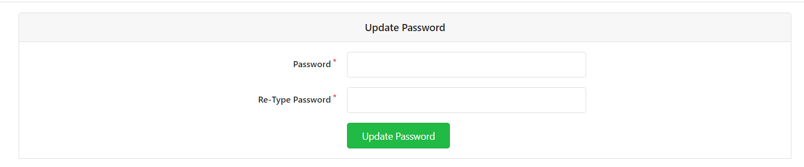

# Fork

## 

## Fork一个Repository

* 案例说明：用户Rose去fork用户Jack的Titanic
  1. 选择需要fork 的repository ，并进入到repository的详情页，根据案例，这里应该Jack/Titanic
  2. 按照图示操作点击 `fork` 按钮
     * 
  3. 核对Owner & Fork from 信息是否正确，这里案例用的`Rose`用户fork  `Jack` 用户的 `Titanic` repository
  4. 并确认respository name ，可以使用Titanic，但建议增加更具标识性的前缀后缀
  5. 内容填写无误后，点击 `Fork Repository` 进行下一步操作 
     * 
  6. 如图所示，`Rose/Titanic` 仓库已经创建成功，forked from Jack/Titanic
     * 

## 同步一个fork

* 案例说明：用户Rose在fork用户Jack的Titanic仓库后，用户Jack和其余贡献者对Titanic进行了内容修改，用户Rose想要在他们的修改的基础上，还要再做一些修改。在开始之前，最好"同步Rose的fork"，以确保在最新的复制版本里工作。
* web页面（推荐）
  1. 选择需要fork 的repository ，并进入到repository的详情页，根据案例这里应该是Rose/Titanic
  2. 点击 `New Pull Request` 按钮，进行下一步操作 
     * 
  3. ！！！**根据案例，merge into 这里填写的是Rose的仓库和分支**
  4. ！！！**根据案例，pull from 这里填写的是Jack的仓库和分支**
     * **第三步和第四步如果反过来，就成了你向别人推送代码了！！！一定要注意！！！一定要注意！！！一定要注意！！！**
  5. 然后可以看下相关代码的分析之后，点击 ` New Pull Request` 进行下一步操作 
     * 
  6. 填写fork的请求标题信息！！！这里最好是配合第7步进行操作
  7. Gitea的特性，可以避免意外合并，在第6步标题信息写好之后，点击 `Start the title with WIP` 按钮进行增加前缀操作！
  8. 进行Assignees选择，可以选择自己
     * 
  9. [接上图]信息填写完毕之后，点击[ `Create Pull Request` 按钮进行下一步操作
     * [接上图]
     * 
  10. 核对请求标题是否正确
  11. 核对相关变更代码
  12. 相关信息都核对完成之后，可以进行删除前缀的操作 点击 ` Remove WIP: prefix` 进行下一步操作
      * 
  13. 核对请求标题是否正确
  14. 点击 `Merge Pull Request` 按钮进行下一步操作
      * 
  15. 信息填写完成后，点击 `Merge Pull Request` 按钮进行下一步操作 
      * 
  16. From Jack/titanic的代码已经合并完成，Rose/Titanic已经同步完成
      * 
* git命令
  1. 
